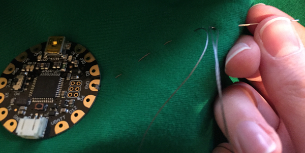
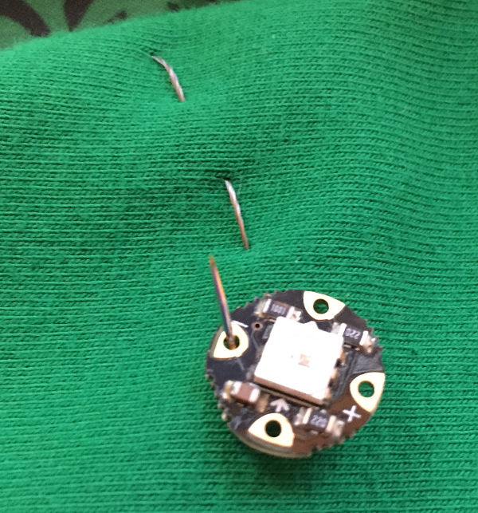

# Getting started with wearables (Part 2)

Now it's time to sew your FLORA and NeoPixel onto an item of clothing to make it wearable. You can sew it to anything at all from a t-shirt to a pair of shoes, or even a bag! Before you sew, it is important to think about where you will position the components and where you will store your battery pack.

To make your first wearable item, make sure you have the following items of kit:

- USB cable
- Adafruit FLORA
- Adafruit NeoPixel
- Conductive thread
- Needle (make sure the eye is small enough to go through the holes on the NeoPixel)
- Battery pack and batteries
- Scissors
- Clear nail varnish (optional)

You will also need an item of clothing of your choice.

## Sewing the circuit

1. First, plan out where your components will go. I chose this jacket because it has a pocket where I can store the battery pack, and a lapel for me to sew the NeoPixel onto. Most of the thread circuit can also be hidden by stitching under the lapel.

  

  Don't forget to think about the orientation of the FLORA - try to position the pins you will be using (GND, VBATT and D6) pointing towards the NeoPixel so that you can sew in a relatively straight line.

1. Cut off a length of conductive thread - [Adafruit recommend](https://learn.adafruit.com/conductive-thread/prep-thread-and-fabric) using the length of your arm as a guide so that the thread does not become too unwieldy to work with.

1. Position your FLORA, then sew from the back of the material through the `GND` hole on the FLORA. Leave about 5-10cm of thread at the back (careful not to pull it all the way through). Sew over the top of the connector and back through the fabric. Repeat this 2-3 more times to create a secure connection around the `GND` pad.

  

1. With your needle on the back of the fabric, use the remaining thread and the 5-10cm you left earlier to tie the ends together in a secure knot. Adafruit recommend using a small blob of clear nail varnish to secure the knot from becoming undone. When the knot is secure, cut off the tail end very short as you don't want it to accidentally touch one of the other threads and cause a short circuit. Don't cut the end that is still threaded into the needle!

1. Using the still threaded part, stitch towards the location you want to place your NeoPixel using a running stitch.

    

1. When you reach the location, sew from the back of the fabric through the **negative** connector on the NeoPixel just as you did on the FLORA, repeating 2-3 times to make a secure connection. When you have finished, use an existing stitch to help you tie a secure knot and then seal the knot and cut the ends short as before.

  
