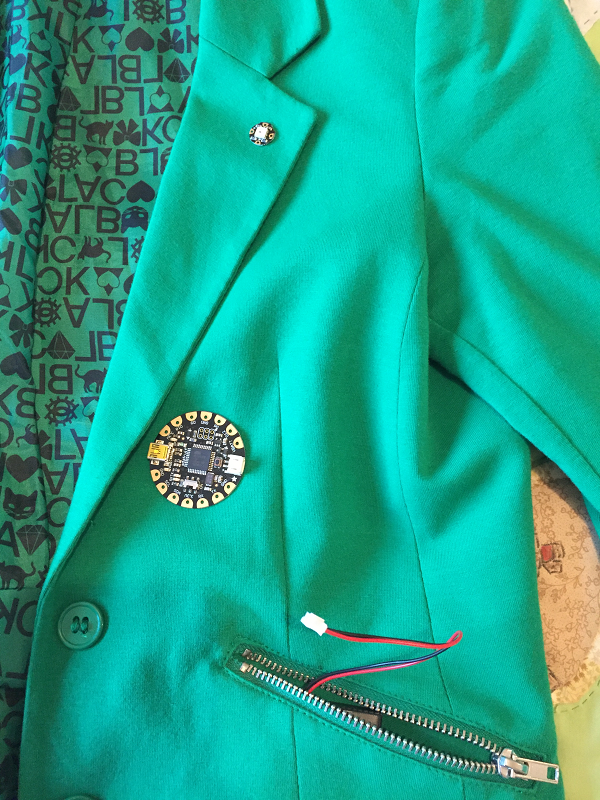
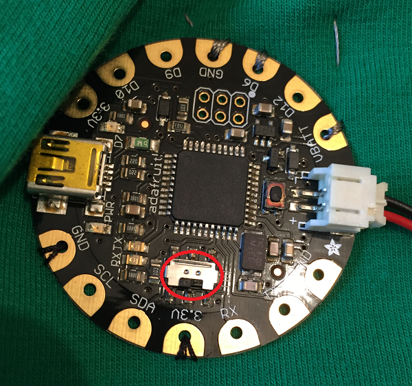

# Getting started with wearables (Part 2)

Now it's time to sew your FLORA and NeoPixel onto an item of clothing to make your tech wearable. You can sew it to anything at all from a t-shirt to a pair of shoes, or even a bag! Before you sew, it is important to think about where you will position the components and where you will store your battery pack. Also don't forget that your circuit is not waterproof and could be dangerous if it gets wet, so don't choose anything you are likely to wear in the rain or which is likely to get wet.

To make your first wearable item, make sure you have the following items of kit:

- USB cable
- Adafruit FLORA
- Adafruit NeoPixel
- Conductive thread
- Needle (make sure the eye is small enough to go through the holes on the NeoPixel)
- Battery pack and batteries
- Scissors
- Clear nail varnish (optional)
- Normal sewing thread (optional)

You will also need an item of clothing of your choice.

## Sewing the ground connection

1. First, plan out where your components will go. I chose this jacket because it has a pocket where I can store the battery pack, and a lapel onto which I could sew the NeoPixel. Most of the thread circuit can also be hidden by stitching under the lapel.

  

  Don't forget to think about the orientation of the FLORA: try to position the pins you will be using (GND, VBATT, and D6) pointing towards the NeoPixel so that you can sew in a relatively straight line.

1. Cut off a length of conductive thread. [Adafruit recommend](https://learn.adafruit.com/conductive-thread/prep-thread-and-fabric) using the length of your arm as a guide so that the thread does not become too long and unwieldy to work with.

1. Position your FLORA, then sew from the back of the material through the `GND` hole on the FLORA. Leave about 5-10cm of thread at the back (careful not to pull it all the way through). Sew over the top of the connector and back through the fabric. Repeat this a couple more times to create a secure connection around the `GND` pad.

  

1. With your needle on the back of the fabric, use the remaining thread and the 5-10cm you left earlier to tie the ends together in a secure knot. If you have some, you can use a small blob of clear nail varnish to secure the knot and prevent it from coming undone. When the knot is secure, cut the tail end very short as you don't want it to accidentally touch one of the other threads and cause a short circuit. Don't cut the end that is still threaded into the needle!

1. Using the thread still in your needle, stitch towards the location you want to place your NeoPixel using a running stitch.

    

1. When you reach the location, sew from the back of the fabric through the **negative** connector on the NeoPixel, over the connector pad and back through the material, just as you did on the FLORA, repeating a couple of times to make a secure connection.

    

1. When you have finished, thread the needle around an existing stitch to help you tie a secure knot and then seal the knot and cut the ends short as before. You **must** knot and cut the thread at the end of each connection and then start afresh: do **not** be tempted to sew everything with one length of thread as this will not work.

  

1. You have just done the same job as your crocodile clip did before, connecting the GND pad on the FLORA to the negative connector on the NeoPixel.

## Connect the power and D6 pin

1. Now you need to repeat this process twice more:

 - Stitch `VBATT` on the FLORA to the `+` connector on the NeoPixel
 - Stitch `D6` on the FLORA to the connector with an arrow pointing **towards** the NeoPixel

 The process is exactly the same as above, except you must be careful to **ensure that the threads do not touch each other at all** or you will cause a short circuit. When you have finished sewing all three connections, your circuit might look something like this:

   

1. You might feel that because we have only sewn to connectors on one side, your FLORA is not securely fastened to the item of clothing. You can easily solve this problem by sewing through some of the connectors with **normal sewing thread** (don't use conductive thread) to secure it.

   

1. Now connect up your battery pack to the FLORA. If your battery pack has an on/off switch, switch it on.

   

1. Finally, turn on the power switch on the FLORA which is very small and can be found next to the connector labelled 3.3V, and you should see the light pattern you programmed earlier displaying on the NeoPixel.

   

1. Parade around showing off your awesome piece of wearable tech!

  

## What next?

Congratulations! You have created your first wearable piece of tech.

- Update your program to make the NeoPixel light up in a different colour pattern, then reconnect the USB cable to your FLORA and upload the new program.
- Can you add more than one NeoPixel to your design? If you do this, you will need to sew connections to the + and - connectors on the NeoPixel, but this time instead of sewing from the FLORA, you will sew from your previous NeoPixel. Instead of connecting the D6 pin to the NeoPixel, sew from the outward pointing arrow of the first NeoPixel to the inward pointing arrow of the second NeoPixel. You will also need to update your code to reflect the fact you now have more than one NeoPixel.
